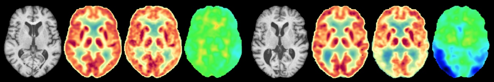

# Zerodose



A tool to assist in personalized abnormality investigation in combined FDG-PET/MRI imaging.
Created by the department of [Clinically Applied Artificial Intelligence](http://caai.dk/) at [Copenhagen University Hospital](https://www.rigshospitalet.dk/)

[][pypi_]
[][status]
[][python version]
[][license]
[][read the docs]
[][tests]

[pypi_]: https://pypi.org/project/zerodose/
[status]: https://pypi.org/project/zerodose/
[read the docs]: https://zerodose.readthedocs.io/
[tests]: https://github.com/ChristianHinge/zerodose/actions?workflow=Tests
[python version]: https://pypi.org/project/zerodose

## Installation

Note that a python3 installation is required for _Zerodose_ to work.
You can install _Zerodose_ via [pip] from [PyPI]:

```console
$ pip install zerodose
```

## Usage

### Synthesize baseline PET

```console
$ zerodose syn -i mr.nii.gz -m brain_mask.nii.gz -o sb_pet.nii.gz
```

### Create abnormality map

```console
$ zerodose abn -p pet.nii.gz -s sb_pet.nii.gz -m brain_mask.nii.gz -o abn.nii.gz
```

Please see the [Command-line Reference] for details.

## Hardware requirements

- TODO

## Issues and contributing

Contributions are very welcome.
If you encounter any problems,
please [file an issue] along with a description.

[pypi]: https://pypi.org/
[file an issue]: https://github.com/ChristianHinge/zerodose/issues
[pip]: https://pip.pypa.io/

<!-- github-only -->

[license]: https://github.com/ChristianHinge/zerodose/blob/main/LICENSE
[contributor guide]: https://github.com/ChristianHinge/zerodose/blob/main/CONTRIBUTING.md
[command-line reference]: https://zerodose.readthedocs.io/en/latest/usage.html
